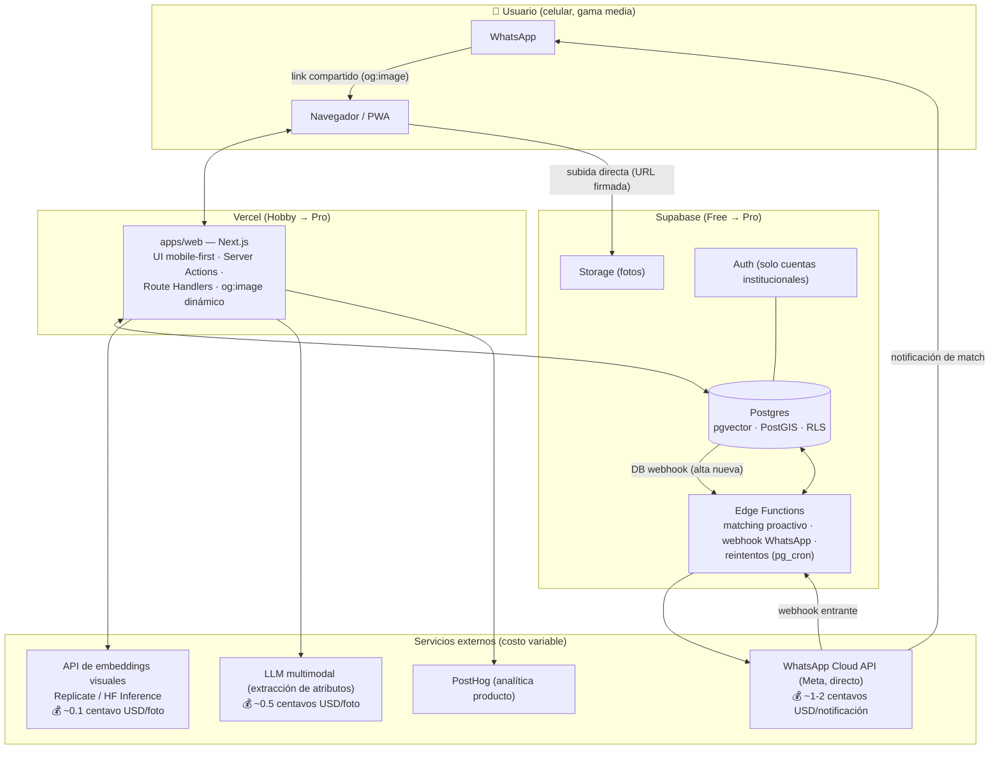
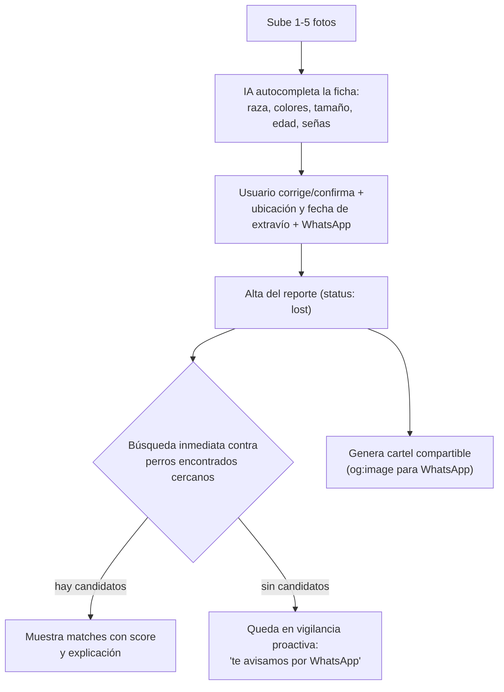
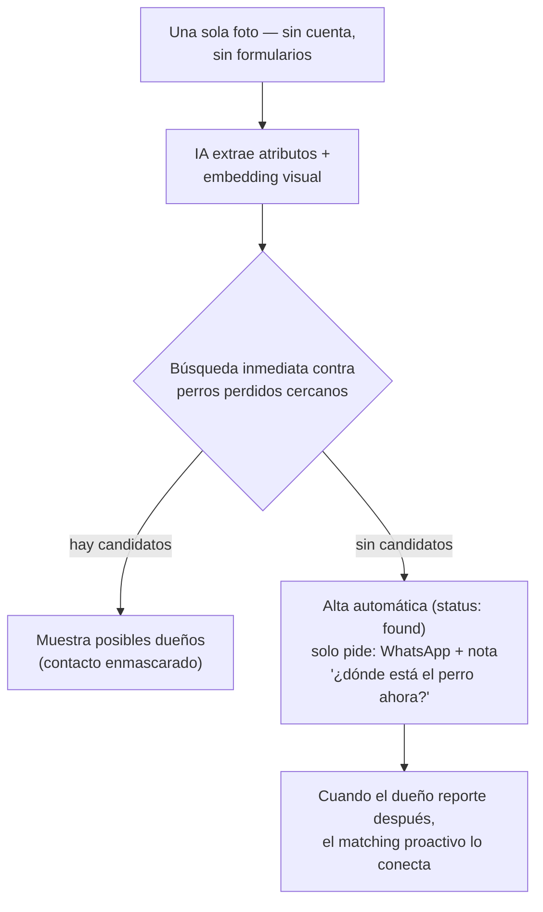
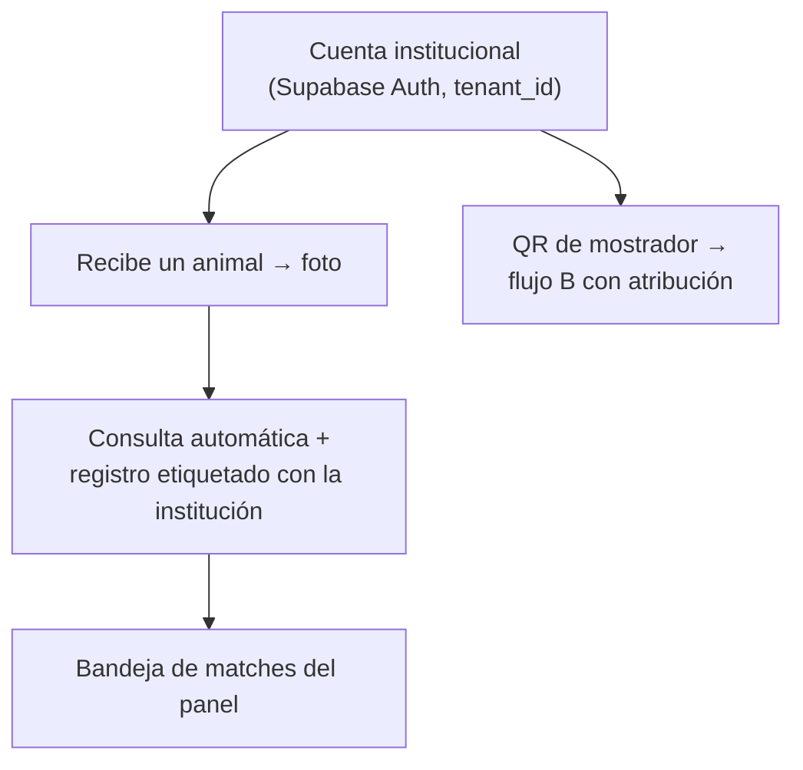
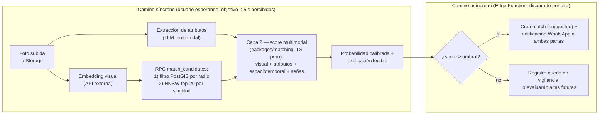

# Arquitectura — LomitoDeVuelta

> Red de reunificación de mascotas impulsada por IA. Lanzamiento: Ciudad de México.
> Documento vivo. Última actualización: 2026-07-15.
> Decisiones formales en [`/docs/adr/`](./adr/). Este documento da la visión de conjunto.

## 1. Visión general

LomitoDeVuelta no es un directorio de anuncios: es un **motor de matching** que compara
automáticamente dos inventarios vivos — perros **perdidos** y perros **encontrados** —
y conecta a dos personas que no saben que se están buscando.

La promesa de producto es "sube una foto y la IA busca por ti". Eso impone tres
propiedades arquitectónicas innegociables:

1. **Fricción cero en el flujo "encontré un perro"**: una foto, sin cuenta, sin
   formularios. Es el lado escaso de la red y no puede perder ni un registro.
2. **Matching proactivo**: cada alta se compara contra el inventario contrario en el
   momento; el sistema avisa por WhatsApp, el usuario no tiene que volver a buscar.
3. **Valor con 50 registros**: el matching es función de densidad local (geo-filtro
   primero), y cada flujo aporta valor individual (ficha compartible, autocompletado
   por IA) aunque la red esté vacía.

## 2. Principios de diseño

| Principio | Qué significa en la práctica |
|---|---|
| **Geo primero, vector después** | El filtro PostGIS reduce el espacio de búsqueda antes que pgvector. La búsqueda es local por diseño. |
| **Gratis hasta validar** | Todo el stack arranca en capas gratuitas (Vercel Hobby, Supabase Free, WhatsApp Cloud API directo, PostHog Free). El único costo variable real del MVP es la inferencia de visión (centavos por foto). |
| **Simple y evolucionable** | Monorepo con pocos paquetes bien delimitados. Nada de colas, microservicios ni Kubernetes. Cada pieza tiene un camino de evolución documentado, no un rediseño. |
| **El dominio de matching es puro** | La lógica de scoring vive en un paquete TypeScript sin dependencias de infraestructura: testeable sin base de datos, portable si cambia el runtime. |
| **Explicable por diseño** | Cada score se descompone en componentes con evidencia legible ("misma mancha en pecho, hallado a 1.8 km, 2 días después"). |
| **Privacidad desde el modelo de datos** | Contacto enmascarado, minimización, consentimiento y borrado son columnas y políticas RLS, no parches. |
| **Guardarraíles para desarrollo AI-assisted** | TypeScript estricto, esquemas Zod en las fronteras, tests en los caminos críticos, convenciones documentadas. |

## 3. Diagrama de componentes

**Reparto de responsabilidades** (detalle en [ADR-0002](./adr/0002-frontera-nextjs-supabase.md)):

- **apps/web (Vercel)** — todo lo interactivo: UI, alta de reportes, pipeline de visión
  síncrono (el usuario está esperando), búsqueda de candidatos vía RPC, generación de
  og:image. El cliente nunca toca la base directamente; siempre pasa por Server
  Actions / Route Handlers.
- **Postgres (Supabase)** — fuente de verdad. La búsqueda de candidatos (geo-filtro +
  vecinos vectoriales) es una función SQL: un solo viaje, datos cerca del índice.
- **Edge Functions (Supabase)** — todo lo que pasa cuando el usuario ya no está
  esperando: matching proactivo disparado por webhook de base de datos al insertar,
  envío de notificaciones WhatsApp, webhook entrante de WhatsApp, reintentos
  programados con pg_cron.
- **Storage (Supabase)** — fotos. El cliente sube directo con URL firmada (evita el
  límite de 4.5 MB de Vercel y no consume cómputo del servidor).

## 4. Flujos de usuario

### Flujo A — "Perdí a mi perro"

### Flujo B — "Encontré un perro" (fricción cero, el flujo sagrado)

### Flujo C — Institucional (veterinarias, refugios, control animal) — *fase posterior al MVP ciudadano*

> **Nota MVP**: el panel institucional (Flujo C) es fase 3 del roadmap. Sin embargo,
> `tenant_id` y las políticas RLS multi-tenant se diseñan **desde la primera
> migración**, porque añadirlos después obliga a reescribir todas las políticas.

## 5. Pipeline de matching (corazón del sistema)

**Las tres capas** (especificación completa en `/docs/matching-engine.md`, Bloque 3):

| Capa | Qué hace | Dónde vive | Objetivo |
|---|---|---|---|
| **1 — Recall visual** | Geo-filtro (radio dinámico según días transcurridos) y vecinos más cercanos por embedding (HNSW) | Función SQL en Postgres | De miles a ~20 candidatos, barato y rápido |
| **2 — Precisión multimodal** | Score ponderado: similitud visual + compatibilidad de atributos + coherencia espaciotemporal (~1-3 km/día) + señas particulares (peso alto) | `packages/matching` (TS puro) | Probabilidad calibrada y explicable |
| **3 — Proactiva** | Cada alta se compara contra el inventario contrario vigente; sobre umbral → notificación a ambas partes | Edge Function vía DB webhook | Nadie tiene que volver a buscar |

**Presupuesto de latencia del camino síncrono** (objetivo < 5 s percibidos, con estados de carga progresivos):

| Paso | Estimado |
|---|---|
| Subida de foto (celular gama media, 4G) | 1–2 s (con compresión client-side) |
| Embedding + extracción de atributos (en paralelo) | 1.5–3 s |
| RPC geo + vector (índices GiST + HNSW) | 100–300 ms |
| Score capa 2 + explicación | < 50 ms |

La UI muestra progreso por etapas ("analizando la foto…", "buscando cerca de ti…") para
que la espera se perciba como trabajo de la IA, no como lentitud.

## 6. Qué es MVP y qué es fase posterior

| Componente | MVP | Fase posterior (no implementar aún) |
|---|---|---|
| Flujos | A y B completos | C (panel institucional), QR de mostrador |
| Especies | Solo perros | Gatos y otras |
| App | PWA mobile-first | App nativa |
| Matching | Capas 1-3 con pesos heurísticos | Calibración aprendida (regresión logística sobre feedback), re-ranking con modelo propio |
| Embeddings | API externa (Replicate/HF) con interfaz `EmbeddingProvider` | Self-hosting GPU (mismo interface, re-embed con versionado) |
| Notificaciones | WhatsApp Cloud API directo + email fallback | Push de PWA, plantillas avanzadas |
| Contacto | Puente enmascarado hasta doble aceptación | Chat interno completo |
| Confianza | Prueba de propiedad ligera, badge "ofrece recompensa" | Escrow de recompensas (Stripe), verificación de identidad |
| Moderación | Detección de duplicados por embedding + revisión manual asistida | Clasificador de lenguaje de estafa, búsqueda inversa automatizada |
| Idioma/zona | Español, CDMX (pero esquema multi-zona y textos externalizados desde día 1) | Multi-idioma, multi-país |
| Monetización | Ninguna (la plataforma no toca dinero) | Planes institucionales, Stripe |

## 7. Mapa de decisiones (ADRs)

| ADR | Decisión | Estado |
|---|---|---|
| [0001](./adr/0001-estructura-monorepo.md) | Monorepo pnpm workspaces: `apps/web`, `packages/matching`, `packages/shared`, `supabase/` | Aceptado |
| [0002](./adr/0002-frontera-nextjs-supabase.md) | Interactivo en Next.js; búsqueda en SQL (RPC); asíncrono en Edge Functions | Aceptado |
| [0003](./adr/0003-pipeline-vision-embeddings.md) | Pipeline síncrono-primero con reintentos; embeddings vía API externa tras interfaz; versionado de modelo en columna | Aceptado |
| [0004](./adr/0004-scoring-multimodal.md) | Capa 1 en SQL, capa 2 en paquete TS puro; pesos parametrizados en BD; feedback humano como dataset | Aceptado |
| [0005](./adr/0005-busqueda-hibrida-geo-vector.md) | Geo-filtro primero (GiST) + KNN exacto sobre el subconjunto; HNSW listo para escalar | Aceptado |
| [0006](./adr/0006-auth-identidad.md) | Ciudadanos sin cuenta (enlace firmado por WhatsApp); instituciones con Supabase Auth magic link | Aceptado |
| [0007](./adr/0007-multitenancy-rls.md) | Multi-tenancy pooled: tablas compartidas + tenant_id + RLS; aislamiento de gestión, no de datos | Aceptado |
| [0008](./adr/0008-notificaciones-whatsapp.md) | Meta WhatsApp Cloud API directo + ledger idempotente + fallback email (Resend) | Aceptado |
| [0009](./adr/0009-moderacion-antifraude.md) | Post-moderación con flags automáticos (duplicados, is_dog, heurísticas de estafa) y revisión humana | Aceptado |
| [0010](./adr/0010-og-image.md) | og:image dinámico con next/og + caché CDN + buster de versión para WhatsApp | Aceptado |
| [0011](./adr/0011-observabilidad.md) | Tabla events como fuente de verdad + PostHog (producto y errores); dashboards = vistas SQL | Aceptado |
| [0012](./adr/0012-entornos-despliegue.md) | Local + dev cloud (previews) + producción; migraciones manuales con checklist | Aceptado |
