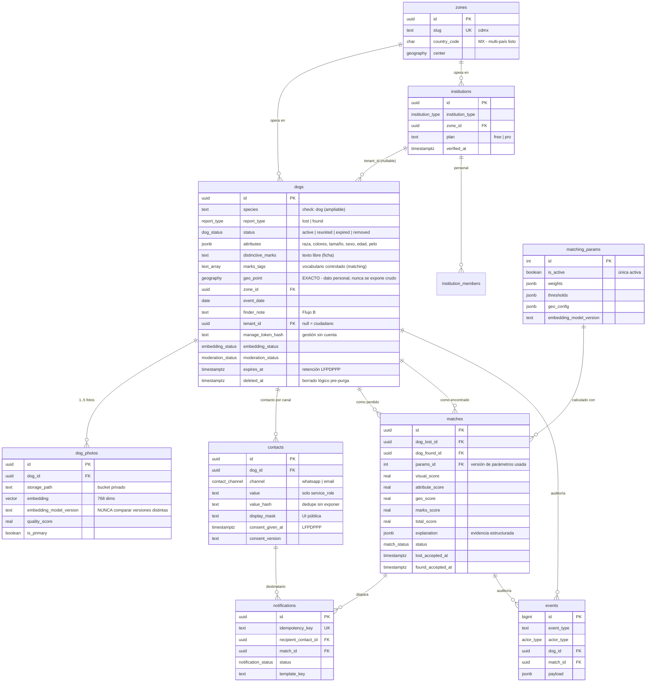

# Modelo de datos — LomitoDeVuelta

> Esquema completo en `supabase/migrations/` (SQL comentado). Este documento da la
> vista de conjunto, el diagrama ER y la justificación de cada decisión de indexado.
> Última actualización: 2026-07-16.

## 1. Diagrama entidad-relación

## 2. Decisiones estructurales y su porqué

| Decisión | Justificación |
|---|---|
| **`attributes` como JSONB, no columnas** | El vocabulario lo produce un LLM y evolucionará; el matching los consume en la capa 2 (TypeScript), nunca como filtro SQL — el recall manda: no se descarta un candidato por atributos en la capa 1. El contrato lo fija un esquema Zod en `packages/shared` (misma validación en escritura y lectura). |
| **Señas en dos columnas** (`distinctive_marks` texto + `marks_tags` array) | El texto libre es para humanos (ficha); las etiquetas normalizadas a vocabulario controlado son para el score. Convertir una en otra es trabajo del LLM en el alta. |
| **Contacto en tabla propia (`contacts`)** | Es EL dato personal del sistema. Aislarlo permite darle el acceso más restrictivo (solo `service_role`), auditarlo por separado y purgarlo sin tocar el reporte. Con `value_hash` se hace dedupe/rate-limit sin leer el dato. |
| **`manage_token_hash` en `dogs`** | Los ciudadanos no tienen cuenta: gestionan su reporte con un enlace firmado que reciben por WhatsApp. Se guarda solo el hash (como una contraseña). Constraint: todo reporte es gestionable por una institución o por un token. |
| **`tenant_id` nullable desde el día 1** | Los reportes ciudadanos (null) y los institucionales conviven en la misma tabla. Añadir multi-tenancy después obligaría a reescribir todas las políticas RLS; añadirlo ahora cuesta una columna. |
| **`zones` desde el día 1** | Estrategia hiperlocal multi-zona. El MVP tiene una fila (CDMX); abrir Guadalajara será un INSERT, no una migración. `country_code` y `timezone` evitan cablear México. |
| **`species` con CHECK `= 'dog'`** | Gatos = fase posterior. Ampliar será relajar un CHECK; el matching ya filtra implícitamente por especie al comparar inventarios. |
| **`matching_params` versionada + `matches.params_id`** | Cada match registra con qué pesos se calculó. Sin ese vínculo, el dataset de feedback sería ininterpretable para calibrar (ADR-0004). |
| **`events` append-only** | Auditoría y embudo de producto en una sola tabla barata. La North Star (reuniones confirmadas) se cuenta aquí, no se infiere. |
| **`expires_at` + `deleted_at` + purga** | Retención LFPDPPP por diseño: los reportes vencen (renovables), el borrado es lógico primero y una purga programada (pg_cron) elimina datos personales en firme. Detalle en Bloque 4. |

## 3. Estrategia de indexado (resumen — detalle en ADR-0005)

| Índice | Tipo | Para qué |
|---|---|---|
| `dogs_geo_idx` | GiST (geography) | El "geo primero": `ST_DWithin` reduce miles de reportes a decenas antes de tocar vectores. |
| `dogs_active_inventory_idx` | B-tree **parcial** (solo activos) | El matching y los listados solo consultan inventario vigente; el índice ignora el histórico. |
| `dog_photos_embedding_hnsw` | HNSW coseno, **parcial** (embedding not null) | Búsqueda vectorial a escala y detección de duplicados. En MVP la búsqueda usa KNN **exacto** sobre el subconjunto geo-filtrado (recall perfecto); el HNSW queda listo para búsquedas globales/escala. |
| `dogs_embedding_pending_idx` | B-tree parcial | Cola de reintentos del pipeline de visión (pg_cron). |
| `matching_params_one_active` | Único parcial | Garantiza una sola configuración activa. |
| `matches` unique `(lost, found)` | Único | Idempotencia del matching proactivo: el mismo par nunca genera dos matches. |
| `events_type_time_idx` | B-tree compuesto | El embudo se lee por tipo de evento en ventanas de tiempo. |
| `notifications.idempotency_key` | Único | Un reintento jamás duplica un WhatsApp. |

**Por qué HNSW y no IVFFlat**: IVFFlat requiere "entrenar" listas con datos existentes y
se degrada con inserciones continuas (nuestro caso: altas diarias); HNSW se mantiene
estable insertando y su recall es superior. Costo: construcción más lenta e índice más
grande — irrelevante a nuestra escala.

**Escala** (ver ADR-0005): este esquema aguanta cientos de miles de reportes sin
cambios. Los saltos evolutivos documentados son: (1) ajustar `m`/`ef_construction` del
HNSW, (2) índices HNSW parciales por versión de modelo al migrar embeddings,
(3) particionado declarativo por `zone_id` si se superan ~1-2 M de filas — ninguno
requiere rediseño del modelo.

## 4. Qué NO está en este esquema (deliberadamente)

- **Chat interno** — el puente de contacto enmascarado basta en MVP (`contacts.display_mask` + notificaciones).
- **Recompensas con dinero** — solo `reward_offered boolean` (badge). Escrow = fase posterior con Stripe.
- **Identidad digital preventiva de mascotas** — fuera del MVP.
- **Tablas de facturación/planes** — `institutions.plan` es un texto simple hasta la fase de monetización.
