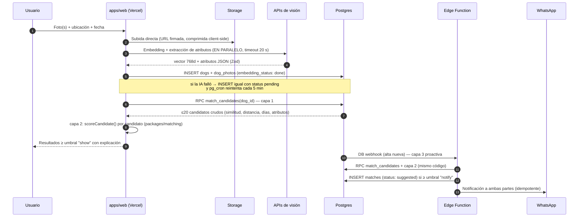

# Motor de matching — especificación técnica

> El corazón del sistema. Este documento especifica el pipeline completo, la fórmula
> de score, la explicabilidad, los casos difíciles y los contratos TypeScript del
> dominio (`packages/matching`). Decisiones formales: ADR-0003, ADR-0004, ADR-0005.
> Última actualización: 2026-07-16.

## 1. Principios

1. **Recall antes que precisión, en ese orden.** La capa 1 (geo + vector) es generosa
   (~20 candidatos); la capa 2 afina. Perder al perro correcto en la capa 1 es
   irrecuperable; un falso positivo en la capa 2 solo cuesta un vistazo del usuario.
2. **La ausencia de un dato nunca penaliza; solo la contradicción.** Un reporte del
   Flujo B puede tener una sola foto y cero atributos confirmados.
3. **Una inferencia fallida jamás pierde un reporte** (ADR-0003).
4. **Todo score es explicable y reproducible**: componentes persistidos + versión de
   parámetros en cada match.

## 2. Pipeline end-to-end



El mismo dominio (`packages/matching`) corre en los dos caminos: interactivo
(Vercel) y proactivo (Edge Function). La única diferencia es el umbral: **mostrar**
es barato (0.55), **notificar** interrumpe a dos personas (0.72).

## 3. Capa 1 — Recall (SQL: `match_candidates`)

- **Geo-filtro dinámico**: radio = `min(max_radius_km, base_radius_km + km_per_day ×
  |días|)`. Con los valores iniciales (3 + 1.5/día, techo 20 km): mismo día → 3 km;
  una semana → 13.5 km; el techo cubre transporte humano dentro de la ciudad.
  Implementación: cota superior constante para el índice GiST + condición dinámica
  por fila (ver SQL y ADR-0005).
- **Ventana temporal**: `|días| ≤ 60` (parámetro). Reportes más viejos expiran de
  todos modos.
- **Similitud visual**: mejor coseno entre **todos los pares de fotos**
  (referencia × candidato) de la misma `embedding_model_version`. Se toma el máximo:
  basta que una foto buena coincida.
- **Salida**: datos crudos, sin puntuar. K = 20.

## 4. Capa 2 — Score multimodal (TypeScript puro)

### 4.1 Fórmula

```
total = w_visual · S_visual + w_attr · S_attr + w_geo · S_geo + w_marks · S_marks
```

Pesos iniciales (fila activa de `matching_params`, **hipótesis pre-calibración**):
`visual 0.45 · attributes 0.20 · spatiotemporal 0.20 · marks 0.15`.

Si un componente no es computable (p. ej. sin embedding aún), se excluye y los pesos
restantes se **renormalizan** — nunca se rellena con ceros, porque eso penalizaría la
ausencia de datos (principio 2). El match lleva el flag correspondiente.

### 4.2 Componentes

**S_visual — similitud visual normalizada**

```
S_visual = clamp((sim − visual_floor) / (visual_ceil − visual_floor), 0, 1)
```

`visual_floor = 0.70`, `visual_ceil = 0.92` son **anclas por modelo de embedding**:
por debajo del piso, la similitud no aporta; por encima del techo, es prácticamente
la misma imagen. ⚠️ Estas anclas son las primeras víctimas del benchmark del Bloque 7
— cada modelo distribuye sus similitudes distinto y DEBEN medirse con fotos reales
de perros (pares mismo-perro vs. perros-distintos).

**S_attr — compatibilidad de atributos estructurados**

Comparación por atributo: coincide = 1, contradice = 0, desconocido en cualquiera de
los dos lados = 0.5 (neutral). Promedio ponderado por **estabilidad** del atributo:

| Atributo | Peso interno | Estabilidad |
|---|---|---|
| `sex` | 0.30 | Estable (y **gate**, ver abajo) |
| `size` | 0.25 | Estable en adultos; volátil si `age_range = puppy` (ver §6) |
| `breed_mix` | 0.20 | Semiestable (la IA puede dudar entre razas parecidas) |
| `colors` | 0.15 | Semivolátil (luz, suciedad, foto) |
| `age_range` | 0.05 | Volátil (estimación) |
| `coat_length` | 0.05 | Volátil (cortes de pelo) |

**Gate de sexo**: si ambos lados tienen `sex` **confirmado por humano**
(`sex_confirmed = true`) y contradicen, el total se limita a 0.30 y se marca
`sex_conflict`. No se descarta del todo: los humanos también se equivocan al sexar
un perro en la calle.

**S_geo — coherencia espaciotemporal**

```
λ(días) = base_radius_km + km_per_day × min(|días|, 30)      // alcance plausible
S_geo   = exp(−max(0, d_km − 1) / λ)                          // ≤1 km es "ahí mismo"
```

Decaimiento exponencial: 1.8 km a los 2 días ≈ 0.88; 15 km el mismo día ≈ 0.01.
La cola larga del exponencial deja vivir la hipótesis "alguien lo transportó".
**Dirección temporal**: si el hallazgo es ≥2 días *anterior* al extravío
(`days_between < −2`), S_geo se multiplica por 0.3 y se marca
`timeline_implausible` — penaliza sin descartar, porque las fechas que reporta la
gente son difusas.

**S_marks — señas particulares (asimétrico, peso alto)**

Sobre `marks_tags` (vocabulario controlado que normaliza el LLM en el alta:
`mancha_pecho_blanca`, `oreja_izq_caida`, `cicatriz_lomo`, `collar_rojo`…):

| Situación | S_marks |
|---|---|
| Alguno de los dos lados sin señas registradas | 0.5 (neutral) |
| Ambos con señas, **cero** coincidencias | 0.35 (penalización leve) |
| 1 coincidencia | 0.80 |
| ≥2 coincidencias | 1.00 |

Asimetría deliberada: una seña coincidente es evidencia fortísima (casi identifica);
su ausencia casi no dice nada (el encontrador pudo no verla). Fase posterior:
ponderar por rareza de la seña (una cicatriz específica vale más que "collar").

### 4.3 Umbrales y acciones

| Umbral | Valor inicial | Acción |
|---|---|---|
| `show` | 0.55 | Aparece en resultados de búsqueda con explicación |
| `notify` | 0.72 | Match `suggested` + WhatsApp a ambas partes (capa 3) |

Anti-spam de la capa 3: máximo 3 notificaciones de match por reporte por día; el par
`(lost, found)` es único en `matches` — un perro nuevo se evalúa una sola vez contra
cada contrario.

### 4.4 Presentación honesta

El porcentaje se acompaña de banda verbal: ≥0.85 "coincidencia muy alta",
0.72–0.85 "alta", 0.55–0.72 "posible". Sin decimales (falsa precisión): "91 %", no
"91.3 %". Cuando el flag `visual_ambiguity` está activo (ver §6), la UI antepone
"hay varios perros parecidos en la zona — revisa las señas particulares".

## 5. Explicabilidad

Cada componente emite **evidencia estructurada** (tipos en §8); `matches.explanation`
persiste la lista JSON. El texto se genera al mostrar, desde plantillas
externalizadas (regla i18n), nunca con LLM en el camino caliente (ADR-0004):

```
[{ kind: "mark_match", tag: "mancha_pecho_blanca" },
 { kind: "distance", km: 1.8, days: 2 },
 { kind: "visual_similarity", similarity: 0.89 }]
→ "91 % · Misma mancha blanca en el pecho · Encontrado a 1.8 km, 2 días después ·
   Muy parecido en las fotos"
```

Orden de presentación: señas primero (lo más convincente para un humano), geo
después, visual al final (es lo menos verbalizable).

## 6. Casos difíciles

| Caso | Estrategia |
|---|---|
| **Fotos malas/oscuras** | `quality_score` (lo estima el LLM en el alta). Si la mejor foto de un lado tiene calidad < 0.4: flag `low_photo_quality`, el peso visual se reduce a la mitad y se renormaliza — los atributos y el geo mandan. La UI pide una foto mejor sin bloquear. |
| **Razas homogéneas** (labradores negros) | Detección de ambigüedad: si ≥3 candidatos caen dentro de una banda de similitud de 0.05 respecto al mejor, flag `visual_ambiguity` — la similitud visual discrimina poco en ese vecindario. El score no cambia; cambia la presentación (revisar señas) y el orden interno prioriza `S_marks`. |
| **Cachorro→adulto** | Si `age_range` difiere en ≥2 escalones y pasaron >90 días entre eventos: `size` y `age_range` se vuelven neutrales (0.5) — un cachorro perdido hace 6 meses hoy es mediano. Las señas y el sexo siguen siendo estables. |
| **Cambio de pelaje** (corte, suciedad) | Ya cubierto por pesos: `coat_length` y `colors` pesan poco. El embedding visual es parcialmente robusto a esto; las señas estructurales (orejas, manchas de piel, cicatrices) no cambian. |
| **Sin embedding aún** (pipeline pendiente) | El candidato participa solo con atributos + geo + señas (renormalización + flag `no_embedding`). Cuando el reintento complete el embedding, el matching proactivo lo re-evalúa. |

## 7. Versionado del modelo de embeddings (runbook)

1. Todo vector lleva `embedding_model_version`; **la RPC solo compara pares de la
   misma versión** (está en el JOIN, no es opcional).
2. Migrar de modelo: (a) re-embeber el inventario **vigente** (activos, no el
   histórico) con el modelo nuevo — script batch, costo acotado; (b) al llegar a
   100 % de cobertura, actualizar `embedding_model_version` en la fila activa de
   `matching_params` y **recalibrar las anclas** `visual_floor/ceil` con el
   benchmark; (c) conservar los vectores viejos ~30 días como rollback.
3. Si la dimensión cambia: columna nueva (`embedding_v2 vector(N)`) e índice HNSW
   parcial propio; la RPC se actualiza en la misma migración. pgvector exige
   dimensión fija por columna indexada — está asumido y documentado.

## 8. Contratos TypeScript (`packages/matching`)

Interfaces del dominio, sin dependencias de infraestructura. La implementación llega
en el Bloque 7; los tipos son el contrato desde ya. (Los stubs con docstrings se
generan en el Bloque 5.)

```ts
// ---------- packages/shared/src/types/dog.ts ----------
export type ReportType = 'lost' | 'found';
export type Size = 'small' | 'medium' | 'large';
export type Sex = 'male' | 'female';
export type AgeRange = 'puppy' | 'young' | 'adult' | 'senior';
export type CoatLength = 'short' | 'medium' | 'long';

/** Atributos extraídos por el LLM y corregibles por el usuario.
 *  Todos opcionales: la ausencia NUNCA penaliza, solo la contradicción. */
export interface DogAttributes {
  breedMix?: string[];
  colors?: string[];
  size?: Size;
  sex?: Sex;
  /** true solo si un humano lo confirmó (activa el gate de sexo) */
  sexConfirmed?: boolean;
  ageRange?: AgeRange;
  coatLength?: CoatLength;
}

// ---------- packages/matching/src/types.ts ----------
/** Reporte de referencia (el que dispara la búsqueda). */
export interface ReferenceReport {
  dogId: string;
  reportType: ReportType;
  attributes: DogAttributes;
  marksTags: string[];
  eventDate: string;           // ISO date
  bestPhotoQuality: number | null;
}

/** Fila cruda que devuelve la RPC match_candidates (capa 1). */
export interface CandidateRaw {
  dogId: string;
  reportType: ReportType;
  visualSimilarity: number | null;  // null si aún no hay embeddings
  bestPhotoId: string | null;
  distanceMeters: number;
  daysBetween: number;              // firmado: hallazgo − extravío
  attributes: DogAttributes;
  marksTags: string[];
  eventDate: string;
}

/** Espejo tipado de la fila activa de matching_params. */
export interface MatchingParams {
  paramsId: number;
  weights: { visual: number; attributes: number; spatiotemporal: number; marks: number };
  thresholds: { show: number; notify: number; visualFloor: number; visualCeil: number };
  geo: { baseRadiusKm: number; kmPerDay: number; maxRadiusKm: number; maxDaysWindow: number };
}

/** Evidencia estructurada: se persiste en matches.explanation;
 *  el texto en español se genera al mostrar (renderExplanation). */
export type Evidence =
  | { kind: 'visual_similarity'; similarity: number }
  | { kind: 'distance'; km: number; days: number }
  | { kind: 'mark_match'; tag: string }
  | { kind: 'attribute_match'; attribute: keyof DogAttributes; value: string }
  | { kind: 'attribute_conflict'; attribute: keyof DogAttributes; reference: string; candidate: string };

export type MatchFlag =
  | 'visual_ambiguity'      // varios candidatos casi igual de parecidos
  | 'sex_conflict'          // sexos confirmados contradictorios (gate)
  | 'timeline_implausible'  // hallado ≥2 días antes del extravío
  | 'no_embedding'          // score sin componente visual
  | 'low_photo_quality';    // peso visual reducido a la mitad

export interface ComponentScore {
  value: number | null;     // null = no computable (excluido y renormalizado)
  weight: number;           // peso EFECTIVO tras renormalización
  evidence: Evidence[];
}

export interface MatchScore {
  total: number;            // [0,1]
  breakdown: {
    visual: ComponentScore;
    attributes: ComponentScore;
    spatiotemporal: ComponentScore;
    marks: ComponentScore;
  };
  flags: MatchFlag[];
  paramsId: number;
}

// ---------- packages/matching/src/score.ts ----------
/** Puntúa un candidato contra la referencia. Función pura y determinista:
 *  misma entrada → mismo score. Es LA función más testeada del sistema. */
export declare function scoreCandidate(
  reference: ReferenceReport,
  candidate: CandidateRaw,
  params: MatchingParams,
): MatchScore;

/** Puntúa, ordena y aplica detección de ambigüedad visual sobre el lote. */
export declare function rankCandidates(
  reference: ReferenceReport,
  candidates: CandidateRaw[],
  params: MatchingParams,
): Array<{ candidate: CandidateRaw; score: MatchScore }>;

// ---------- packages/matching/src/explain.ts ----------
/** Evidencia → frase en español desde plantillas externalizadas (i18n-ready). */
export declare function renderExplanation(score: MatchScore, locale: 'es-MX'): string;
```

## 9. Calibración con feedback humano

- **Desde el día 1** se acumula el dataset sin trabajo extra: cada match persiste sus
  componentes + `params_id`; cada transición de estado (aceptado/rechazado/reunión
  confirmada) queda en `events`.
- **Disparador de calibración**: ~200 matches con veredicto humano.
- **Método**: regresión logística offline (script de análisis, no servicio) —
  features = componentes del score; label = `confirmed_reunion`/`accepted` vs.
  `rejected`. El resultado propone una fila nueva de `matching_params`; activarla es
  un UPDATE reversible y todo match posterior queda ligado a ella.
- Los rechazos con `feedback_note` alimentan además la revisión cualitativa (¿qué ve
  el humano que el score no ve?).

## 10. Tests del dominio (resumen; estrategia completa en Bloque 6)

Casos dorados mínimos de `scoreCandidate` — fixtures sin infraestructura:

1. Mismo perro obvio (sim 0.90, 1.8 km, 2 días, 1 seña) → total ≥ 0.85.
2. Labrador negro genérico entre 5 similares → flag `visual_ambiguity`.
3. Sexos confirmados contradictorios → total ≤ 0.30 + `sex_conflict`.
4. Sin embedding → renormalización correcta (pesos suman 1) + `no_embedding`.
5. Cachorro hace 6 meses vs. adulto hoy → `size`/`age_range` neutrales.
6. Hallado 5 días antes del extravío → `timeline_implausible` y S_geo × 0.3.
7. Ausencia de atributos en Flujo B (solo foto) → nunca peor que neutral.
